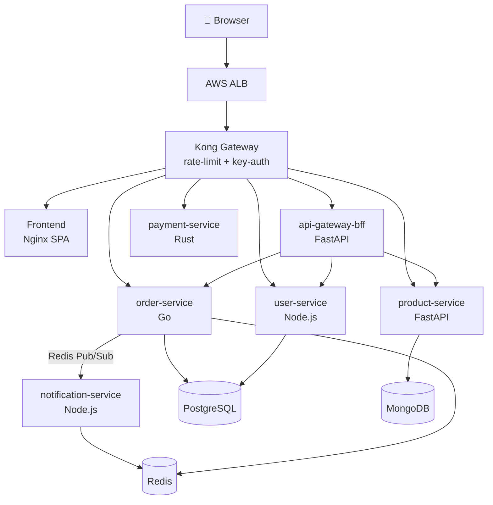

# 🛒 Kubernetes Microservice E-Commerce Platform

A **production-like** e-commerce platform built on AWS EKS for hands-on learning. Six independently deployable microservices, each in a different language/framework, connected through Kong Gateway and GitOps-deployed via ArgoCD.

---

## Architecture



## Services

| Service | Language | Port | Database | Description |
|---------|----------|------|----------|-------------|
| `user-service` | Node.js + Express | 3000 | PostgreSQL | Auth, JWT, user profiles |
| `product-service` | Python + FastAPI | 8000 | MongoDB | Product catalogue, text search |
| `order-service` | Go + Gin | 8080 | PostgreSQL + Redis | Orders, inventory, publishes events |
| `payment-service` | Rust + Actix-web | 8090 | In-memory | Payment processing simulation |
| `notification-service` | Node.js | 3002 | Redis (sub) | Consumes order events, sends notifications |
| `api-gateway-bff` | Python + FastAPI | 3001 | — | Aggregates service calls for frontend |
| `frontend` | HTML/JS + Nginx | 80 | — | SPA served via Nginx |

## Platform Components

| Component | Purpose |
|-----------|---------|
| **Kong Gateway** | API gateway: rate-limiting, key-auth, path routing |
| **HashiCorp Vault** | Secret management (dev mode locally, Raft in prod) |
| **ArgoCD** | GitOps CD — App-of-Apps pattern |
| **Prometheus** | Metrics scraping with PrometheusRule CRDs |
| **Grafana** | Dashboards |
| **AWS WAF** | Layer 7 protection on ALB |

## Quick Start — Local (k3d)

```bash
# 1. Prerequisites: install k3d, kubectl, docker, skaffold (no Homebrew per AGENTS.md)

# 2. One-time setup
./scripts/local-setup.sh

# 3. Build + deploy all services
./scripts/deploy-local.sh

# 4. Port-forward to hit services directly
./scripts/port-forward.sh

# 5. Open frontend
open http://localhost:8888
```

## Deploy to AWS EKS

```bash
# 1. Set AWS credentials
export AWS_ACCESS_KEY_ID=...
export AWS_SECRET_ACCESS_KEY=...
export AWS_DEFAULT_REGION=ap-southeast-1

# 2. Terraform
./scripts/infra-init.sh
./scripts/infra-apply.sh   # ~15-20 min first run

# 3. Bootstrap GitOps
./scripts/argocd-bootstrap.sh

# 4. Seed Vault secrets
./scripts/vault-setup.sh

# 5. Trigger CI by pushing to main → ArgoCD deploys automatically!
```

## CI/CD Pipeline

Each service has its own GitHub Actions workflow in `.github/workflows/`:

```
push to services/user-service/** →
  1. Lint (ESLint / ruff / go vet / clippy)
  2. Build Docker image
  3. Push to ECR (if main branch)
  4. Update Helm values.yaml image tag → git push
  5. ArgoCD detects Git change → deploys
```

Infrastructure changes → `tf-apply.yml` → plan on PR, apply on merge.

## Directory Structure

```
k8s-microservice-ecommerce/
├── infrastructure/terraform/  # VPC, EKS, ECR, WAF, IAM
├── services/                  # 7 service source directories
│   ├── user-service/          # Node.js + Express
│   ├── product-service/       # Python + FastAPI
│   ├── order-service/         # Go + Gin
│   ├── payment-service/       # Rust + Actix-web
│   ├── notification-service/  # Node.js + ioredis
│   ├── api-gateway-bff/       # Python + FastAPI
│   └── frontend/              # Vanilla HTML/JS + Nginx
├── helm-charts/               # Per-service Helm charts + databases chart
│   └── databases/             # Bitnami postgresql + mongodb + redis
├── .github/workflows/         # 8 CI/CD workflows (per service + Terraform)
├── argocd/apps/               # App-of-Apps + per-service Application manifests
├── platform/
│   ├── kong/                  # KongPlugin, KongIngress, routes.yaml
│   ├── vault/                 # Helm values + HCL policies
│   └── observability/         # PrometheusRule CRDs
├── scripts/                   # 8 runnable scripts
├── skaffold.yaml              # Local dev build + deploy orchestration
├── LEARNING_NOTES.md          # Deep-dives: K8s, GitOps, observability concepts
└── AGENTS.md                  # Project constraints and conventions
```

## Learning Notes

→ See [LEARNING_NOTES.md](LEARNING_NOTES.md) for deep-dives on:
- Why each language was chosen per service
- How Vault injection works step-by-step
- IRSA vs node-level IAM
- GitOps vs traditional CI/CD
- Kong vs raw Nginx Ingress
